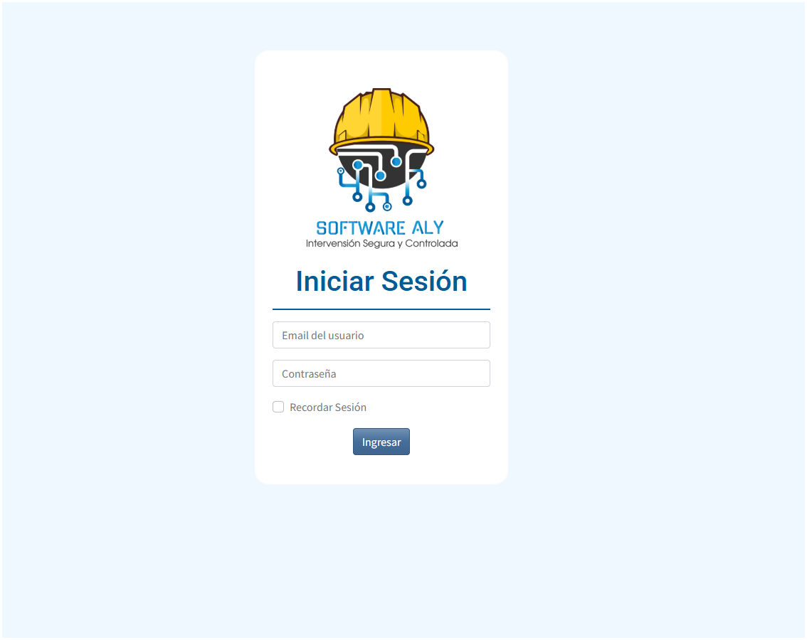

# Gestion de dolencias

Plataforma en PHP para la administracion de dolencias en paciente

permite consultar dolencias
resgistar dolcencias
recomendaciones por dolencias segun paciente
administrar usuarios

## Demo

Descrgue e inicialice la BD

## Screenshots

